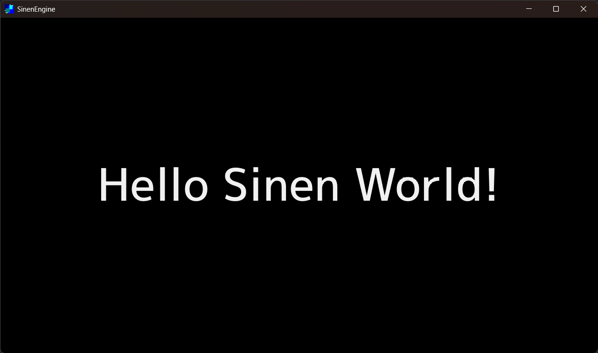
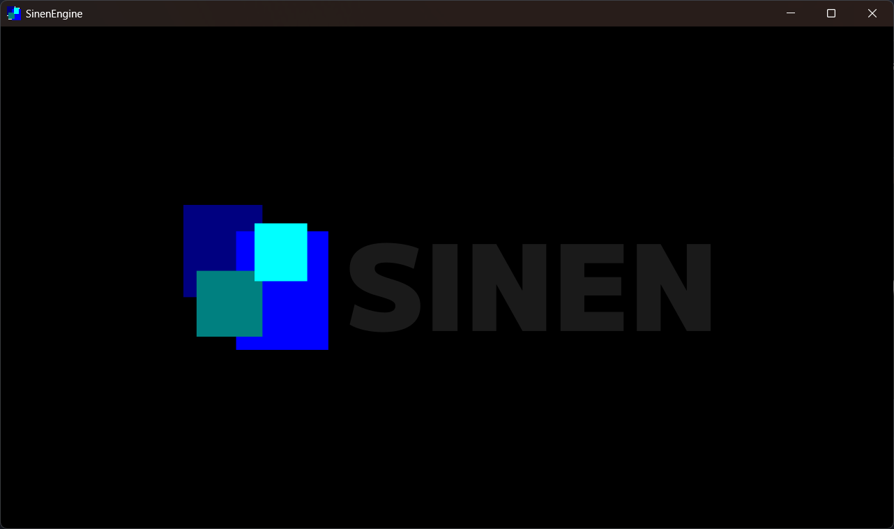
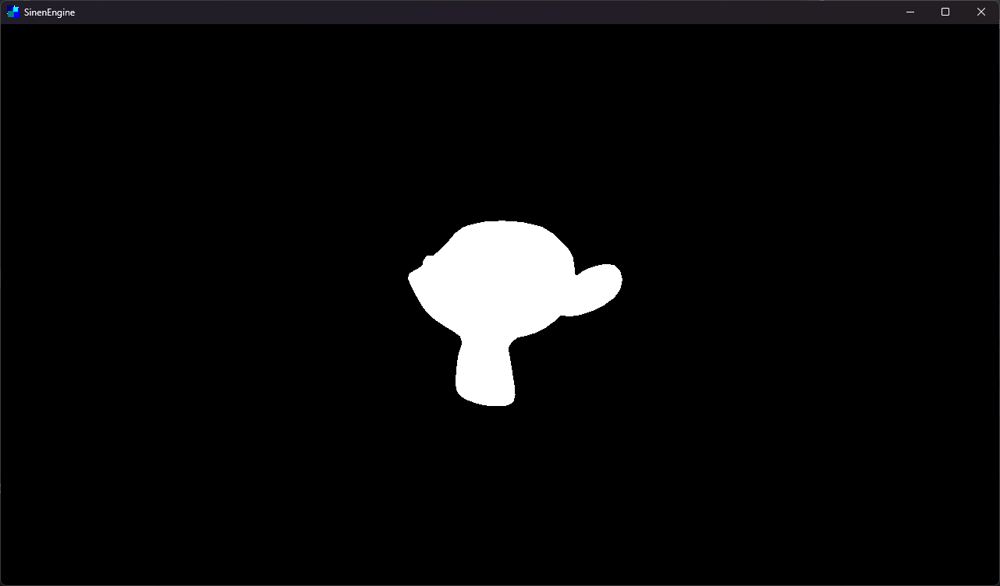
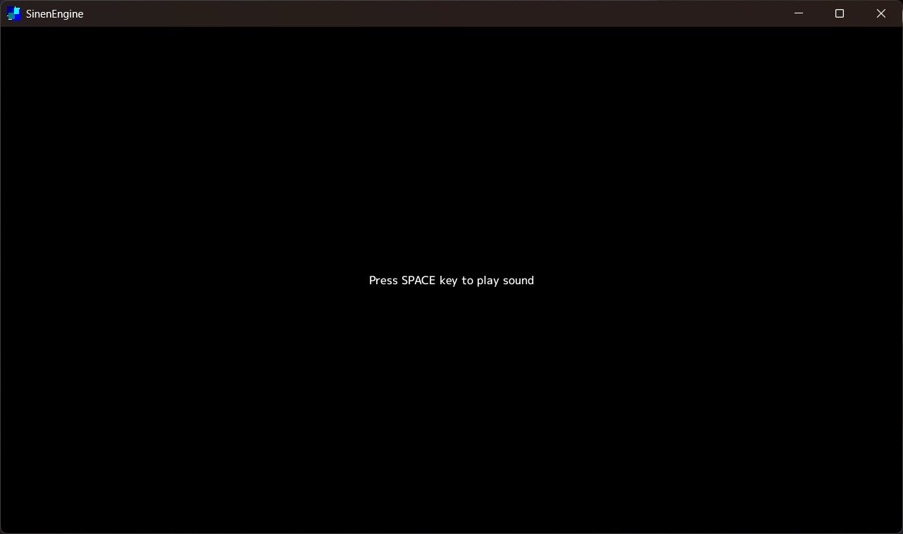

# Examples
This directory contains examples of how to use the `sinen`.
  
01-19: unit features examples.  
20-29: integration features examples.
  
Content for this example is currently being prepared.

## How to run
Run `works` or `editor` executable binary on the each example directory.
  
I will add minimal executable binary.

## 01 Hello World

## 02 Texture

## 03 Model

## 04 Sound

