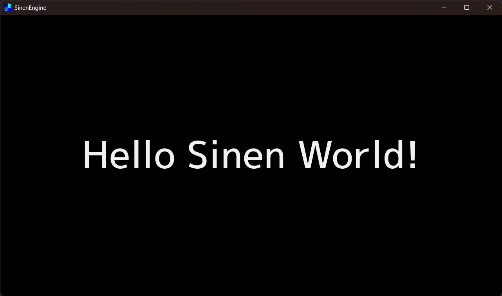
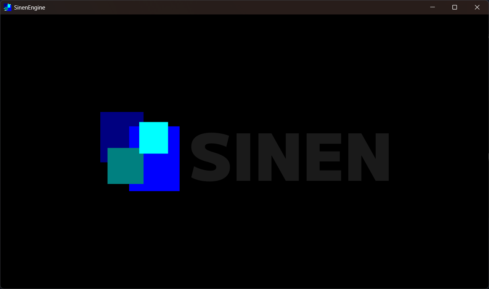
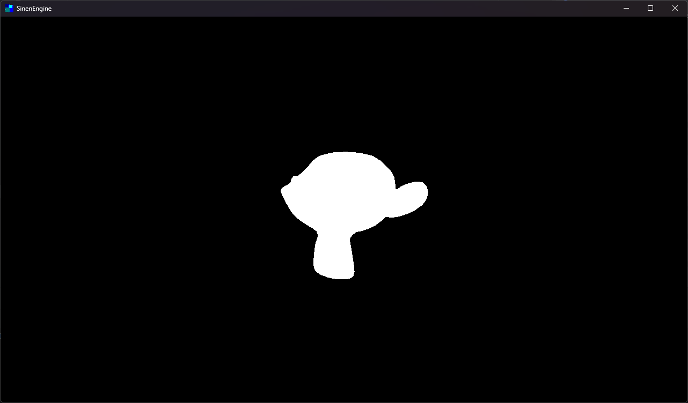
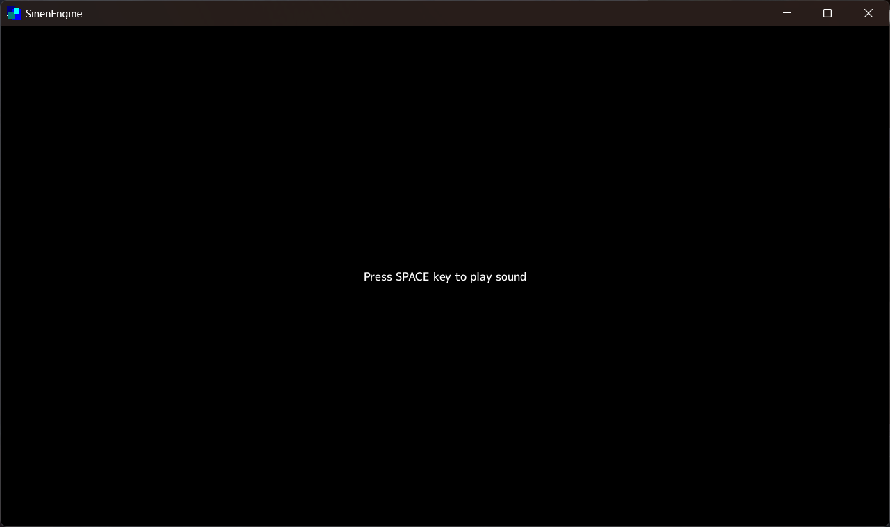
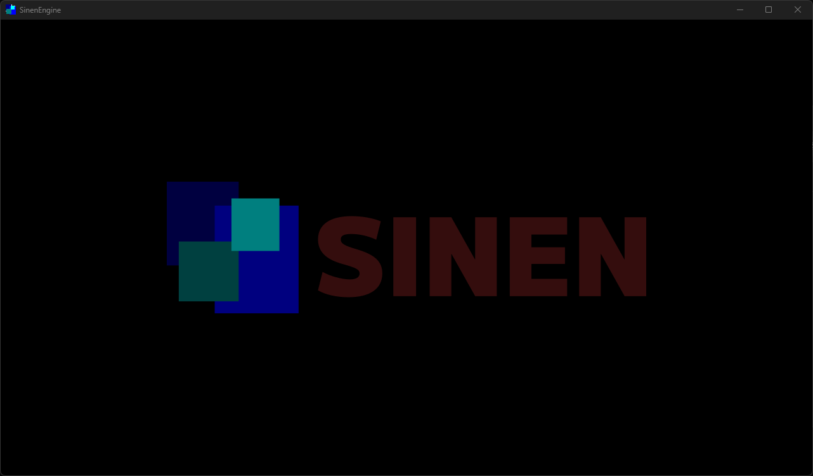
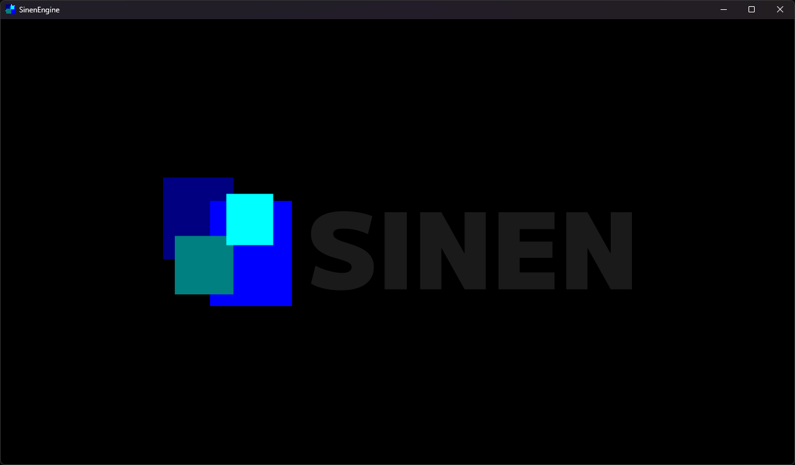
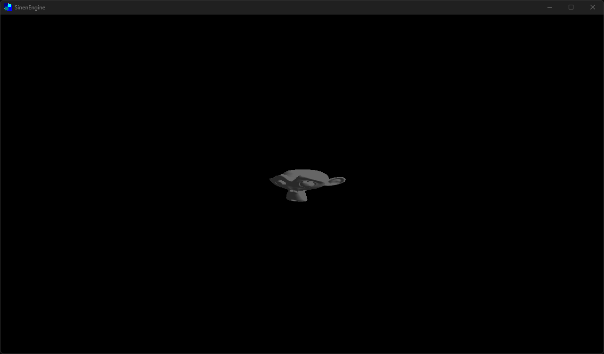
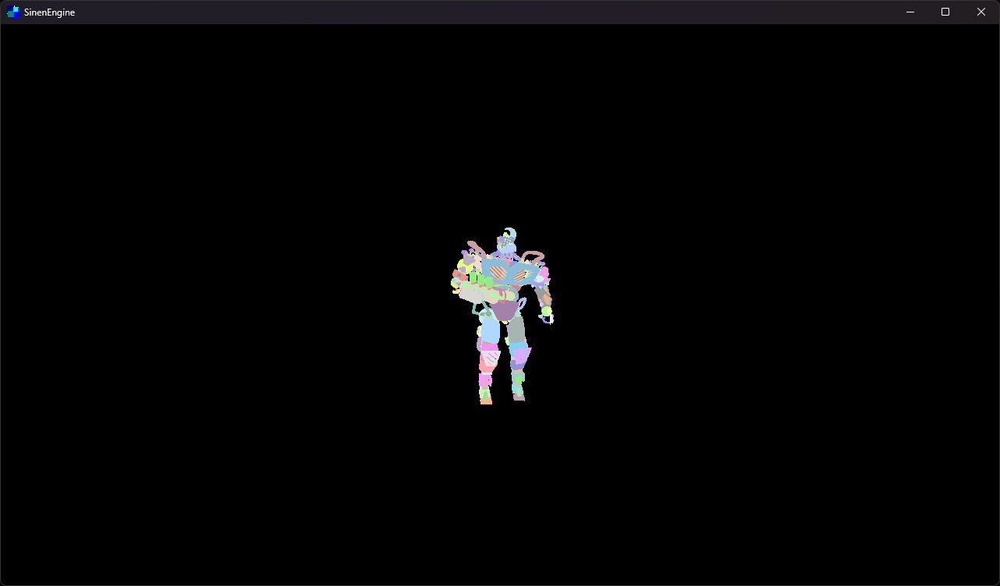

# Examples
This directory contains examples of how to use the `sinen`.
  
01-19: unit features examples.  
20-29: integration features examples.
  
Content for this example is currently being prepared.

## How to run
- Windows  
Run `sinen` executable binary on this directory or each example directory.
- Android  
Install `sinen-arm64-v8a` apk on your device, and place examples/* directory on /sdcard/Android/media/astomih.sinen.app directory. Then run `Sinen` app.

## 01 Hello World


## 02 Texture


## 03 Model


## 04 Sound


## 05 Shader


## 06 Shader runtime


## 07 Render texture


## 08 Animation


## 15 Video Encode
Encodes a generated RGBA8 animation through the Video API and reads it back.

## 16 Video Decode
Decodes an AVI file through the Video API and draws the frames as a texture.

## 17 Archive
Packages `17_archive/sna` into `archive_sample.sna` and runs `main.luau` from the archive.

```bat
cd examples\17_archive
build_sna.bat
..\..\build\msvc2026-debug\sinen.exe archive_sample.sna
```

## 18 Procedural Model
Builds sphere, cylinder, and custom pyramid models from Luau with `sn.MeshBuilder`.

## 19 Compute
Runs a compute shader from Luau, writes RGBA pixels into a `ComputeBuffer`, downloads them, and displays the result as a texture.

## 20 Ray Tracing
Builds BLAS/TLAS and dispatches a ray generation / miss / closest-hit shader pipeline from Luau through `sn.Raytracing`.

## 21 Ray Query
Builds BLAS/TLAS and traces inline rays from a compute shader through `sn.Raytracing` acceleration-structure bindings.

## Luau Unit Tests
The Luau test runner lives in `../tests/luau` and launches the same way as an example directory.

```bat
cd ..\tests\luau
..\..\build\msvc2026-debug\sinen.exe
```
