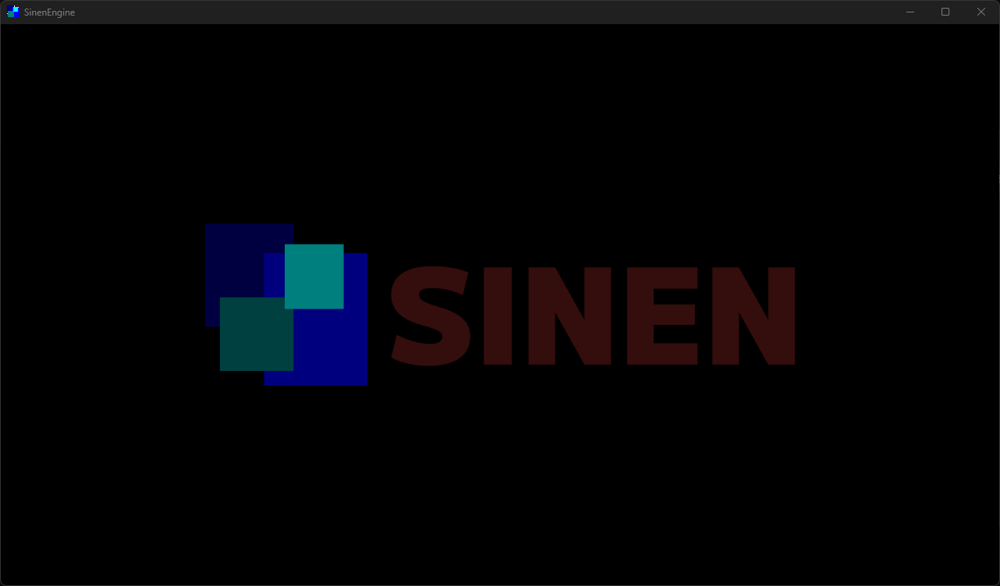
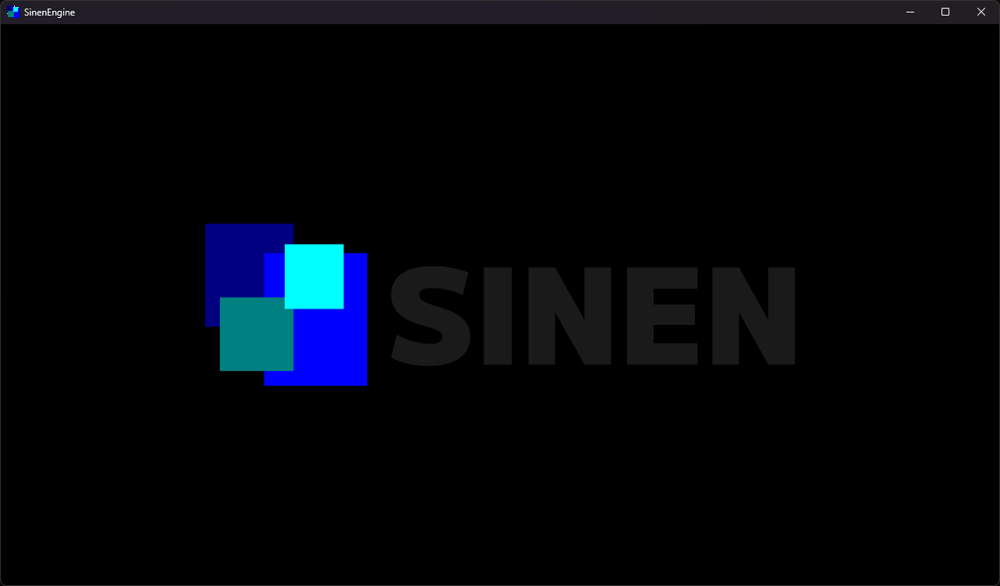
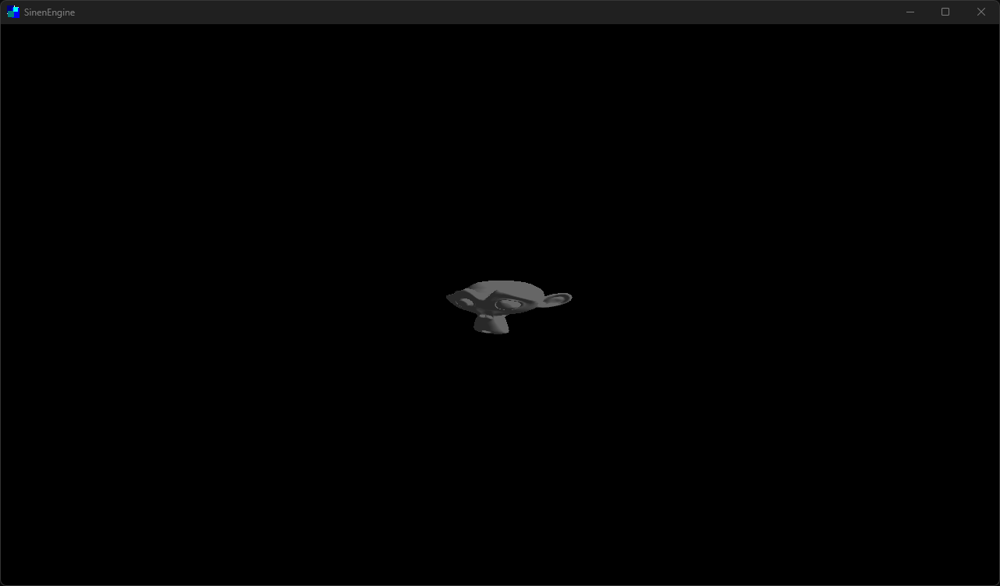
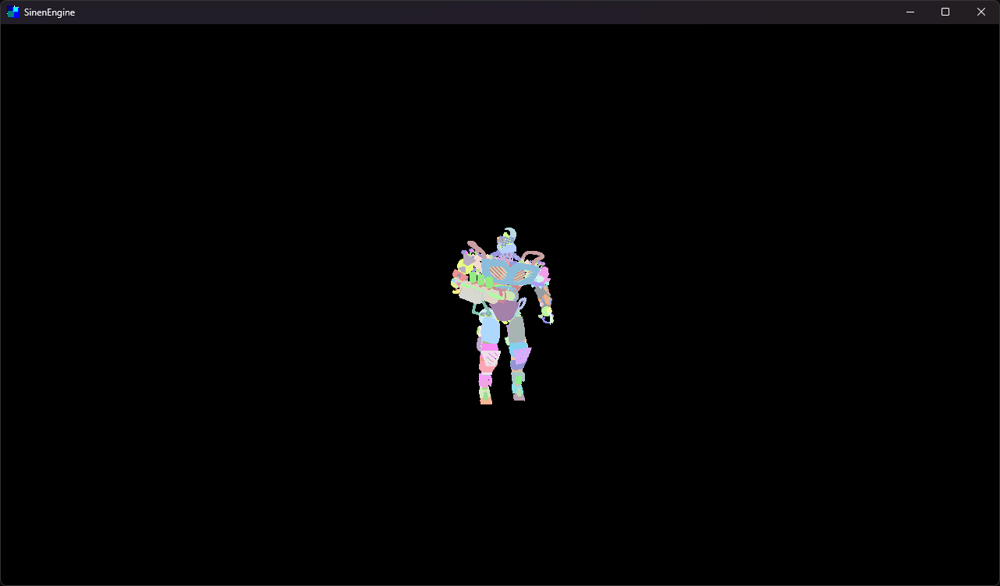

# Examples
This directory contains examples of how to use the `sinen`.
  
01-19: unit features examples.  
20-29: integration features examples.
  
Content for this example is currently being prepared.

## How to run
- Windows  
Run `sinen` executable binary on this directory or each example directory.
- Android  
Install `sinen-arm64-v8a` apk on your device, and place examples/* directory on /sdcard/Android/media/astomih.sinen.app directory. Then run `Sinen` app.

## 01 Hello World

## 02 Texture

## 03 Model

## 04 Sound

## 05 Shader

## 06 Shader runtime

## 07 Render texture

## 08 Animation

  
## Top down shooting
